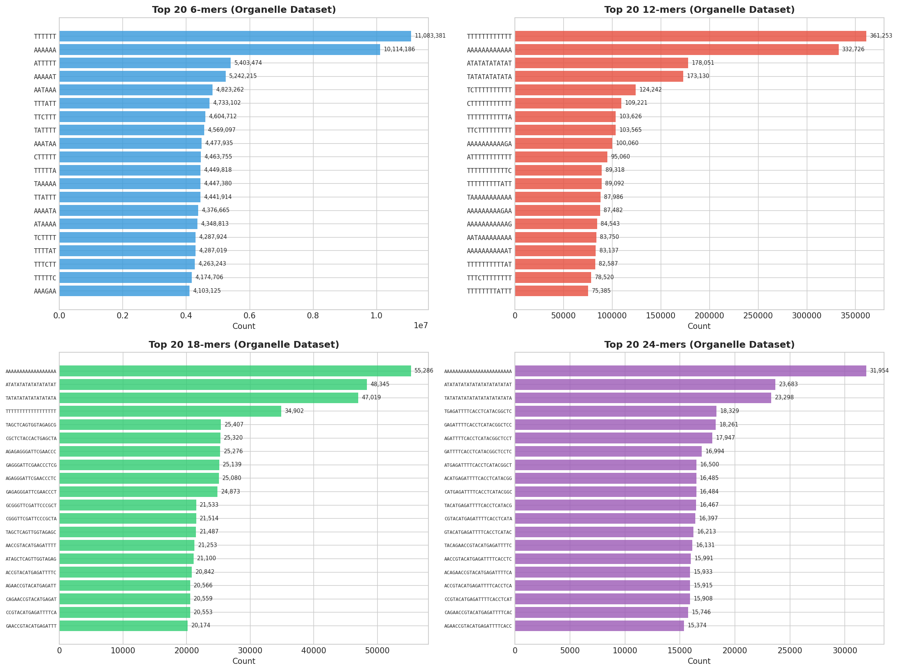
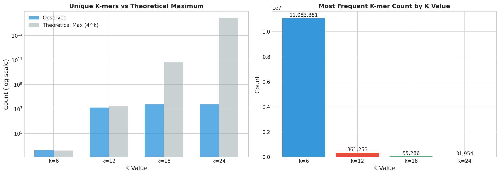
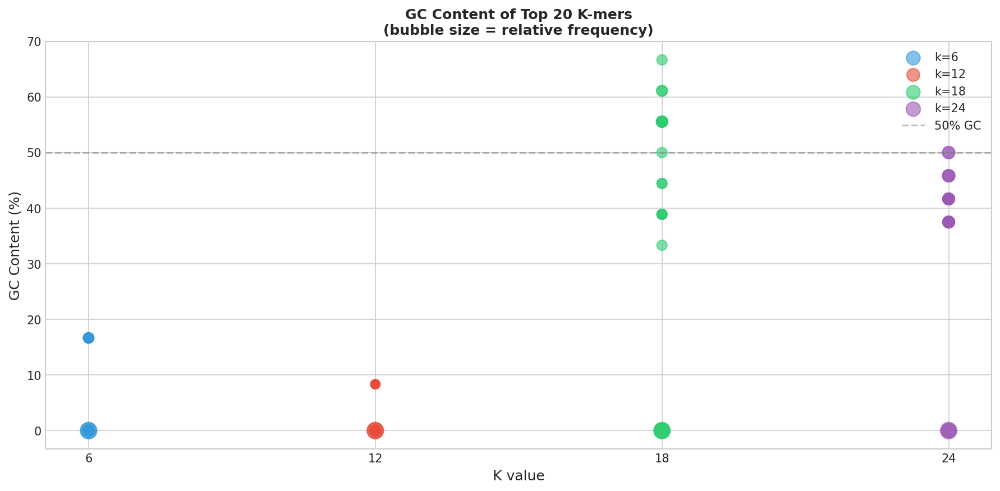
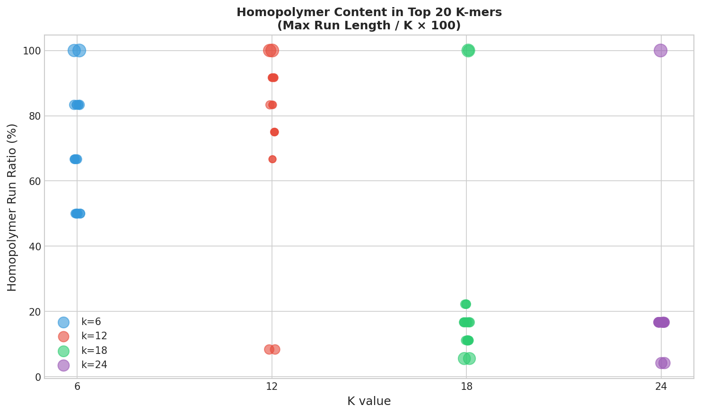

# K-mer Analysis Report

## OpenGenome2 Project - Organelle Dataset

**Analysis Date:** 2025-12-07 02:00:47
**Dataset:** Organelle sequences (~32,240 mitochondrial/chloroplast genomes)
**K Values Analyzed:** 6, 12, 18, 24
**Filter:** min_count ≥ 10

---

## Executive Summary

This report presents k-mer frequency analysis across multiple k values (6, 12, 18, 24) 
on the organelle genome dataset. K-mer analysis reveals patterns in sequence composition, 
repetitive elements, and sequence complexity that are characteristic of organellar genomes.

### Key Findings

1. **High AT Bias:** Top k-mers across all k values show strong AT bias, consistent with 
   organellar genome composition
2. **Conserved Sequences:** At higher k values (18-24), specific conserved sequences 
   emerge representing functional genomic elements
3. **Repeat Patterns:** AT dinucleotide repeats (ATATAT...) appear prominently at all k values

---

## Summary Statistics

| K | Unique K-mers | Theoretical Max (4^k) | Coverage | Total Occurrences | Max Count | Mean Count |
|---|---------------|----------------------|----------|-------------------|-----------|------------|
| 6 | 4,502 | 4,096 | 100.00% | 2,816,603,527 | 11,083,381 | 625633.84 |
| 12 | 13,299,501 | 16,777,216 | 79.27% | 2,799,262,677 | 361,253 | 210.48 |
| 18 | 25,661,426 | 68,719,476,736 | 0.04% | 2,101,893,084 | 55,286 | 81.91 |
| 24 | 26,052,876 | 281,474,976,710,656 | 0.00% | 1,927,939,397 | 31,954 | 74.00 |

---

## Top 20 K-mers by K Value

### K = 6 (6-mers)

| Rank | K-mer | Count | GC% |
|------|-------|-------|-----|
| 1 | `TTTTTT` | 11,083,381 | 0.0% |
| 2 | `AAAAAA` | 10,114,186 | 0.0% |
| 3 | `ATTTTT` | 5,403,474 | 0.0% |
| 4 | `AAAAAT` | 5,242,215 | 0.0% |
| 5 | `AATAAA` | 4,823,262 | 0.0% |
| 6 | `TTTATT` | 4,733,102 | 0.0% |
| 7 | `TTCTTT` | 4,604,712 | 16.7% |
| 8 | `TATTTT` | 4,569,097 | 0.0% |
| 9 | `AAATAA` | 4,477,935 | 0.0% |
| 10 | `CTTTTT` | 4,463,755 | 16.7% |
| 11 | `TTTTTA` | 4,449,818 | 0.0% |
| 12 | `TAAAAA` | 4,447,380 | 0.0% |
| 13 | `TTATTT` | 4,441,914 | 0.0% |
| 14 | `AAAATA` | 4,376,665 | 0.0% |
| 15 | `ATAAAA` | 4,348,813 | 0.0% |
| 16 | `TCTTTT` | 4,287,924 | 16.7% |
| 17 | `TTTTAT` | 4,287,019 | 0.0% |
| 18 | `TTTCTT` | 4,263,243 | 16.7% |
| 19 | `TTTTTC` | 4,174,706 | 16.7% |
| 20 | `AAAGAA` | 4,103,125 | 16.7% |

### K = 12 (12-mers)

| Rank | K-mer | Count | GC% |
|------|-------|-------|-----|
| 1 | `TTTTTTTTTTTT` | 361,253 | 0.0% |
| 2 | `AAAAAAAAAAAA` | 332,726 | 0.0% |
| 3 | `ATATATATATAT` | 178,051 | 0.0% |
| 4 | `TATATATATATA` | 173,130 | 0.0% |
| 5 | `TCTTTTTTTTTT` | 124,242 | 8.3% |
| 6 | `CTTTTTTTTTTT` | 109,221 | 8.3% |
| 7 | `TTTTTTTTTTTA` | 103,626 | 0.0% |
| 8 | `TTCTTTTTTTTT` | 103,565 | 8.3% |
| 9 | `AAAAAAAAAAGA` | 100,060 | 8.3% |
| 10 | `ATTTTTTTTTTT` | 95,060 | 0.0% |
| 11 | `TTTTTTTTTTTC` | 89,318 | 8.3% |
| 12 | `TTTTTTTTTATT` | 89,092 | 0.0% |
| 13 | `TAAAAAAAAAAA` | 87,986 | 0.0% |
| 14 | `AAAAAAAAAGAA` | 87,482 | 8.3% |
| 15 | `AAAAAAAAAAAG` | 84,543 | 8.3% |
| 16 | `AATAAAAAAAAA` | 83,750 | 0.0% |
| 17 | `AAAAAAAAAAAT` | 83,137 | 0.0% |
| 18 | `TTTTTTTTTTAT` | 82,587 | 0.0% |
| 19 | `TTTCTTTTTTTT` | 78,520 | 8.3% |
| 20 | `TTTTTTTTATTT` | 75,385 | 0.0% |

### K = 18 (18-mers)

| Rank | K-mer | Count | GC% |
|------|-------|-------|-----|
| 1 | `AAAAAAAAAAAAAAAAAA` | 55,286 | 0.0% |
| 2 | `ATATATATATATATATAT` | 48,345 | 0.0% |
| 3 | `TATATATATATATATATA` | 47,019 | 0.0% |
| 4 | `TTTTTTTTTTTTTTTTTT` | 34,902 | 0.0% |
| 5 | `TAGCTCAGTGGTAGAGCG` | 25,407 | 55.6% |
| 6 | `CGCTCTACCACTGAGCTA` | 25,320 | 55.6% |
| 7 | `AGAGAGGGATTCGAACCC` | 25,276 | 55.6% |
| 8 | `GAGGGATTCGAACCCTCG` | 25,139 | 61.1% |
| 9 | `AGAGGGATTCGAACCCTC` | 25,080 | 55.6% |
| 10 | `GAGAGGGATTCGAACCCT` | 24,873 | 55.6% |
| 11 | `GCGGGTTCGATTCCCGCT` | 21,533 | 66.7% |
| 12 | `CGGGTTCGATTCCCGCTA` | 21,514 | 61.1% |
| 13 | `TAGCTCAGTTGGTAGAGC` | 21,487 | 50.0% |
| 14 | `AACCGTACATGAGATTTT` | 21,253 | 33.3% |
| 15 | `ATAGCTCAGTTGGTAGAG` | 21,100 | 44.4% |
| 16 | `ACCGTACATGAGATTTTC` | 20,842 | 38.9% |
| 17 | `AGAACCGTACATGAGATT` | 20,566 | 38.9% |
| 18 | `CAGAACCGTACATGAGAT` | 20,559 | 44.4% |
| 19 | `CCGTACATGAGATTTTCA` | 20,553 | 38.9% |
| 20 | `GAACCGTACATGAGATTT` | 20,174 | 38.9% |

### K = 24 (24-mers)

| Rank | K-mer | Count | GC% |
|------|-------|-------|-----|
| 1 | `AAAAAAAAAAAAAAAAAAAAAAAA` | 31,954 | 0.0% |
| 2 | `ATATATATATATATATATATATAT` | 23,683 | 0.0% |
| 3 | `TATATATATATATATATATATATA` | 23,298 | 0.0% |
| 4 | `TGAGATTTTCACCTCATACGGCTC` | 18,329 | 45.8% |
| 5 | `GAGATTTTCACCTCATACGGCTCC` | 18,261 | 50.0% |
| 6 | `AGATTTTCACCTCATACGGCTCCT` | 17,947 | 45.8% |
| 7 | `GATTTTCACCTCATACGGCTCCTC` | 16,994 | 50.0% |
| 8 | `ATGAGATTTTCACCTCATACGGCT` | 16,500 | 41.7% |
| 9 | `ACATGAGATTTTCACCTCATACGG` | 16,485 | 41.7% |
| 10 | `CATGAGATTTTCACCTCATACGGC` | 16,484 | 45.8% |
| 11 | `TACATGAGATTTTCACCTCATACG` | 16,467 | 37.5% |
| 12 | `CGTACATGAGATTTTCACCTCATA` | 16,397 | 37.5% |
| 13 | `GTACATGAGATTTTCACCTCATAC` | 16,213 | 37.5% |
| 14 | `TACAGAACCGTACATGAGATTTTC` | 16,131 | 37.5% |
| 15 | `AACCGTACATGAGATTTTCACCTC` | 15,991 | 41.7% |
| 16 | `ACAGAACCGTACATGAGATTTTCA` | 15,933 | 37.5% |
| 17 | `ACCGTACATGAGATTTTCACCTCA` | 15,915 | 41.7% |
| 18 | `CCGTACATGAGATTTTCACCTCAT` | 15,908 | 41.7% |
| 19 | `CAGAACCGTACATGAGATTTTCAC` | 15,746 | 41.7% |
| 20 | `AGAACCGTACATGAGATTTTCACC` | 15,374 | 41.7% |

---

## Visualizations

### Figure 1: Top 20 K-mers Comparison


Horizontal bar charts showing the 20 most frequent k-mers for each k value. 
Note the prevalence of AT-rich sequences across all k values.

### Figure 2: K-mer Statistics


Left: Comparison of observed unique k-mers vs theoretical maximum (4^k).
Right: Maximum k-mer count by k value.

### Figure 3: GC Content Analysis


GC content distribution of top 20 k-mers by k value. Bubble size represents 
relative frequency. The dashed line indicates 50% GC content.

### Figure 4: K-mer Diversity


Left: K-mer space coverage (percentage of possible k-mers observed).
Right: Mean k-mer frequency by k value.

### Figure 5: Homopolymer Analysis


Analysis of homopolymer runs (consecutive identical nucleotides) in top k-mers.
Higher ratios indicate more repetitive sequence content.

---

## Biological Interpretation

### AT Bias in Organellar Genomes
The predominance of AT-rich k-mers reflects the well-documented AT bias in 
organellar genomes, particularly mitochondrial genomes. This bias is thought 
to result from:
- Mutation pressure toward A and T
- Selection for AT-rich codons
- Reduced selection pressure on non-coding regions

### Conserved Sequences at Higher K Values
At k=18 and k=24, specific non-repetitive sequences become prominent:
- These likely represent highly conserved functional elements
- Possible origins include:
  - rRNA genes (highly conserved)
  - tRNA genes
  - Protein-coding gene motifs
  - Regulatory elements

### Repeat Structure
The prominence of AT dinucleotide repeats indicates:
- Simple sequence repeats common in organellar genomes
- Potential for replication slippage
- Non-coding intergenic regions

---

## Methods

### K-mer Extraction
- K-mers extracted using sliding window approach
- Window slides by 1 bp across each sequence
- Only forward strand analyzed

### Filtering
- Minimum count threshold: 10 occurrences
- Filters low-frequency k-mers that may represent:
  - Sequencing errors
  - Rare variants
  - Assembly artifacts

### Analysis Pipeline
```
Data: /data/parquet/organelle
↓
K-mer extraction (RDD mapPartitions)
↓
Counting (reduceByKey)
↓
Filtering (min_count ≥ 10)
↓
Sorting and top-20 selection
↓
Report generation
```

---

## File Outputs

| File | Description |
|------|-------------|
| `01_top20_kmers_comparison.png` | 2×2 grid of top 20 k-mers for each k value |
| `02_kmer_statistics.png` | Statistics comparison charts |
| `03_kmer_gc_content.png` | GC content scatter plot |
| `04_kmer_diversity.png` | Coverage and mean frequency |
| `05_homopolymer_analysis.png` | Homopolymer run analysis |
| `KMER_ANALYSIS_REPORT.md` | This report |

---

*Generated by OpenGenome2 K-mer Analysis Pipeline*
